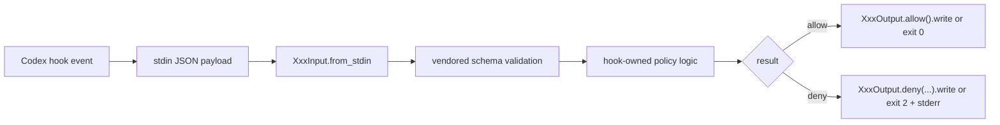

# Architecture

`codex-hookkit` is intentionally small. It provides the stable pieces needed to
write Python Codex hooks without guessing the hook payload contract.

## Design Goals

- Treat upstream Codex generated JSON schemas as the source of truth.
- Keep the public Python API thin and predictable.
- Make real hooks normal Python files owned by the consuming project.
- Keep policy, review orchestration, trust-state writes, and schema downloads
  outside the stable package API.
- Keep the CLI as a sample guard runner, schema lister, and skeleton helper.

## Package Shape

```text
src/codex_hookkit/
  __init__.py       # public import-first API re-export
  core/
    schemas.py      # schema discovery, loading, and jsonschema validation
    inputs.py       # generated Pydantic classes for schema-valid hook inputs
    outputs.py      # generated Pydantic classes for schema-valid hook outputs
    decisions.py    # allow / deny helpers over generated outputs
  cli/
    __init__.py
    main.py         # sample guard runner, schemas, scaffold, init
    _scaffold.py    # private CLI skeleton text
    __main__.py
```

The repository also contains non-package examples and maintainer tools:

```text
examples/
  secret_guard_policy.py
  python_hooks/
  hooks.json
  codex_review_hooks.json

tools/
  generate_pydantic_models.py
  update_codex_hook_schemas.py
  trust_codex_hooks.py
```

## Library Data Flow



`schemas.py` is the small but important core piece that loads vendored schema
JSON and validates payloads. Generated input and output models call into this
layer, so it stays in `core`.

## Public API

The intended import path is:

```python
from codex_hookkit import PreToolUseInput, deny
```

Stable concepts:

- `StructuredInput`: base class for generated, schema-validated input models.
- generated input classes such as `PreToolUseInput` and
  `PermissionRequestInput`.
- `StructuredOutput`: base class for generated, schema-validated output models.
- generated output classes such as `PreToolUseOutput` and
  `PermissionRequestOutput`.
- `Decision`, `allow`, and `deny`: small compatibility helpers.
- `load_schema`, `schema_path`, `available_schemas`, and `validate`.

For live `PreToolUse` guard denials, prefer `deny.stderr_exit(...)`.
`PreToolUseOutput.deny(...)` builds the schema-valid top-level
`decision="block"` / `reason` structured shape, but `codex exec` v0.133.0
still fails live `PreToolUse` hooks that write structured stdout.

Not public package API:

- project policy rules
- Codex review orchestration
- Codex hook trust-state writing
- upstream schema downloading
- skeleton text internals

Those live in `examples/` and `tools/`.

## Schema Strategy

The package vendors only generated hook schema JSON files from `openai/codex`.
Those files live under `third_party/openai-codex-hook-schemas/generated` in the
repository and are included in the wheel under:

```text
codex_hookkit/vendor/openai-codex-hook-schemas/generated
```

This is deliberately a snapshot, not a Git submodule:

- reviews show exactly which schema JSON files changed
- the package does not pull in the full Codex Rust codebase
- updates are explicit and pinned through `UPSTREAM.md`

Update the snapshot with:

```sh
uv run python tools/update_codex_hook_schemas.py
```

## CLI Role

The `codex-hookkit` CLI is intentionally small:

- `guard`: minimal sample / generic guard runner
- `schemas`: schema discovery
- `scaffold`: hook skeleton generation
- `init`: minimal project skeleton generation

Trust-state writes, review hooks, and schema downloads are repository tools or
examples, not installed CLI commands.

## Generated Models

`src/codex_hookkit/core/inputs.py` and `src/codex_hookkit/core/outputs.py` are
generated from the vendored Codex schemas. They should not be edited by hand.

Regenerate them with:

```sh
uv run python tools/generate_pydantic_models.py
```

The test suite includes an exact sync check so generated classes cannot drift
from the generator.

## Local Dogfooding

The repository includes `.codex/hooks.json` for dogfooding:

- `PreToolUse` runs the CLI sample guard.
- `PermissionRequest` runs the CLI sample guard.
- `PostToolUse` runs the Python review example.
- `Stop` runs the Python review example.

The review example is deliberately outside package API. It shows one way to
wire a two-phase review hook, but consuming projects should copy and adapt it.
The Stop phase may run inferred non-mutating local verification commands before
launching the nested review, and includes those results in the review prompt.

## Boundaries

This project is a toolkit, not a full policy engine.

- Schema validation belongs in `core/schemas.py`.
- Generated input models belong in `core/inputs.py`.
- Generated output models belong in `core/outputs.py`.
- Decision helpers belong in `core/decisions.py`.
- Sample policy belongs in `examples/`.
- Maintainer-only operational helpers belong in `tools/`.
- CLI argument parsing and sample runner behavior belong in `cli/`.
