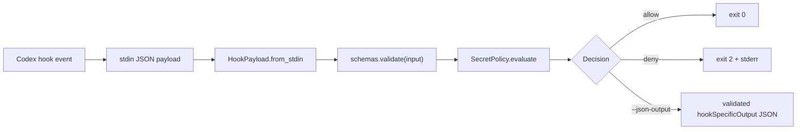

# Architecture

`codex-hookkit` is intentionally small. It is a Python helper package for
building Codex hook guards without guessing the hook payload contract.

## Design Goals

- Treat upstream Codex generated JSON schemas as the source of truth.
- Keep the Python API thin and predictable.
- Make hook guards easy to run from `stdin` in Codex CLI.
- Prefer a safe default policy, while leaving real product policy to callers.
- Avoid vendoring the full `openai/codex` repository unless it becomes useful.

## Package Shape

```text
src/codex_hookkit/
  schemas.py      # schema discovery, loading, and jsonschema validation
  payload.py      # HookPayload parsing from stdin, stream, or dict
  decisions.py    # allow / deny decision helpers and hook JSON builders
  policy.py       # minimal SecretPolicy default guard
  cli.py          # codex-hookkit command line entrypoint
```

The repository also contains:

```text
third_party/openai-codex-hook-schemas/
  generated/*.schema.json
  UPSTREAM.md

tools/update_codex_hook_schemas.py
.codex/hooks.json
tests/test_cli.py
```

## Data Flow



## Schema Strategy

The package vendors only `openai/codex` generated hook schema JSON files.
Those files live under `third_party/openai-codex-hook-schemas/generated`.

At build time, Hatch includes the snapshot inside the wheel at:

```text
codex_hookkit/vendor/openai-codex-hook-schemas/generated
```

At development time, `schemas.py` can also read the local `third_party`
snapshot. This keeps local tests and editable usage simple.

This is deliberately a snapshot, not a Git submodule:

- Reviews show exactly which schema JSON files changed.
- The package does not pull in the full Codex Rust codebase.
- Updates are explicit and pinned through `UPSTREAM.md`.

## Public API

The intended import path is:

```python
from codex_hookkit import HookPayload, SecretPolicy, allow, deny
```

Stable concepts:

- `HookPayload`: parsed hook payload plus convenience accessors.
- `SecretPolicy`: small default policy for secret-file and token access.
- `Decision`: allowed or denied result.
- `allow` / `deny`: builders for both simple decisions and Codex JSON output.
- `validate`: validate arbitrary input or output against vendored schemas.

The current default policy is conservative but not complete. It blocks common
direct reads of `.env`, `.pypirc`, `.npmrc`, `.netrc`, `.ssh`, private key file
names, and selected token environment names.

## CLI Contract

`codex-hookkit guard` reads one JSON payload from `stdin`.

Default behavior:

- valid and allowed payload: exit `0`
- invalid payload: exit `2` with stderr
- denied payload: exit `2` with stderr

With `--json-output`, denials and allows are emitted as validated
`hookSpecificOutput` JSON and the process exits `0`.

## Local Codex Hook Config

The repository includes `.codex/hooks.json` for dogfooding:

- `PreToolUse` runs `codex-hookkit guard --schema pre-tool-use`
- `PermissionRequest` runs `codex-hookkit guard --schema permission-request`

The command uses `uv run python -m codex_hookkit.cli` so local changes are
tested before an installed wheel.

## Boundaries

This project is a toolkit, not a full policy engine.

Keep these boundaries in mind:

- Schema validation belongs in `schemas.py`.
- Payload normalization belongs in `payload.py`.
- Codex output shaping belongs in `decisions.py`.
- Security rules belong in `policy.py` or caller-owned policies.
- CLI argument parsing and exit behavior belong in `cli.py`.

Do not add product-specific policy directly to the default package unless it is
generic enough to help most Codex hook users.
